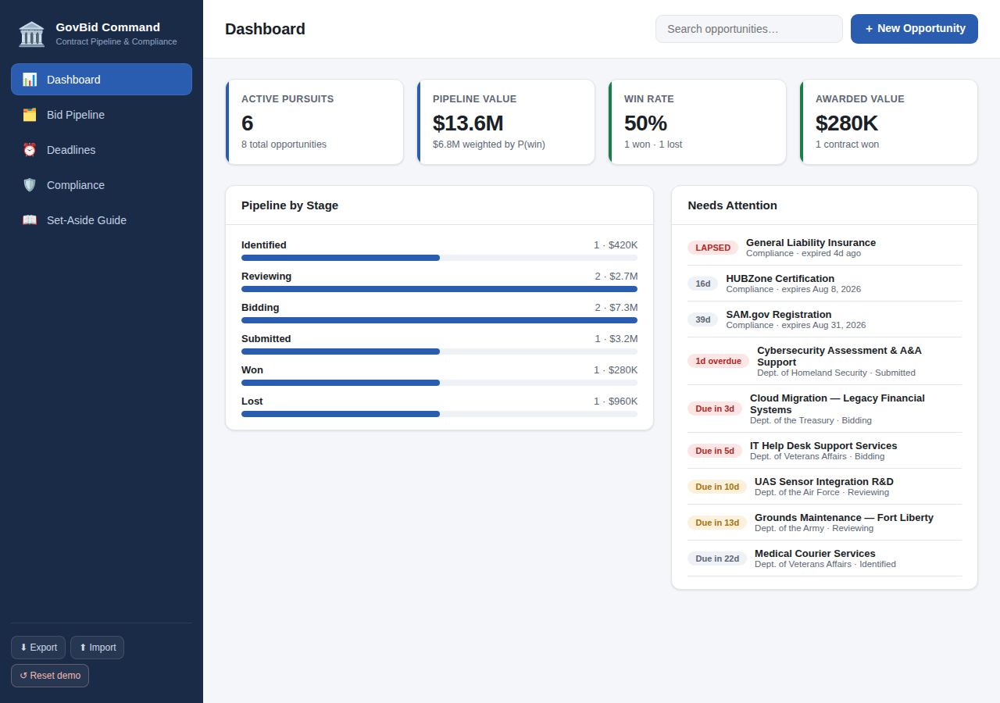
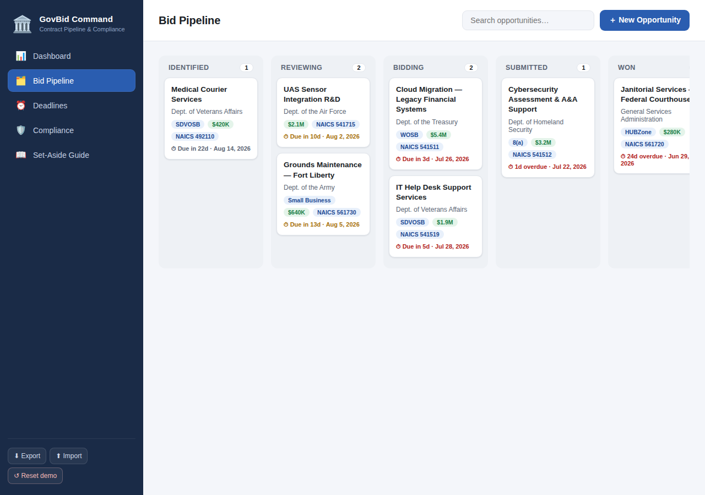

# 🏛️ GovBid Command

**A federal contract pipeline & compliance manager for small-business government contractors.**

GovBid Command helps a small firm keep its federal business-development effort organized in one
place: track opportunities from discovery to award, manage the proposal pipeline, never miss a
response deadline, and stay ahead of the registration and certification renewals that keep you
eligible to win.

It runs **100% in the browser** — no build step, no server, no API keys, no accounts. Data is
saved locally in your browser (`localStorage`) and can be exported/imported as JSON.




---

## Why this is useful for government contracting

Winning federal work is as much about *not dropping the ball* as it is about writing a great
proposal. Set-aside eligibility lapses, a missed SAM.gov renewal, or a blown response deadline can
disqualify you instantly. GovBid Command is built around those realities:

| Feature | What it does for you |
| --- | --- |
| **Dashboard** | KPIs at a glance — active pursuits, pipeline value (raw + weighted by win probability), win rate, awarded value — plus a "Needs Attention" feed of expiring certs and near-term deadlines. |
| **Bid Pipeline** | A drag-and-drop Kanban board (Identified → Reviewing → Bidding → Submitted → Won/Lost). Each card shows agency, set-aside type, NAICS, value, and a live deadline countdown. |
| **Deadlines** | A sorted, color-coded table of every response due date on your active pursuits so nothing slips. |
| **Compliance** | Track SAM.gov registration, 8(a)/WOSB/HUBZone/SDVOSB certifications, CMMC, FCL, insurance — with expiration status and lapse warnings. |
| **Set-Aside Guide** | A built-in reference to the major SBA small-business set-aside programs and their key eligibility rules. |

Each opportunity captures the fields that matter in federal BD: **solicitation number, issuing
agency, NAICS code, set-aside type, estimated value, stage, response due date, win probability,
and notes** (incumbent, teaming partners, key requirements).

---

## Getting started

Just open `index.html` in any modern browser:

```bash
# from the project root
open index.html          # macOS
xdg-open index.html      # Linux
# or serve it:
python3 -m http.server 8000   # then visit http://localhost:8000
```

The app loads with a realistic sample dataset so you can explore immediately. Use **Reset demo**
in the sidebar to restore it at any time.

## Usage tips

- **Add an opportunity:** click **＋ New Opportunity** (top right).
- **Move a bid through the pipeline:** drag its card between columns. Dropping into *Won* or *Lost*
  auto-sets win probability to 100% / 0%.
- **Edit anything:** click a card or a table row.
- **Search:** the top-bar search filters the pipeline across title, agency, solicitation, NAICS,
  set-aside, and notes.
- **Back up / move machines:** **Export** downloads a JSON file; **Import** restores it.

## Project structure

```
index.html        # markup + modals
css/styles.css    # styling (light/dark aware, responsive)
js/data.js        # seed dataset + set-aside reference content
js/app.js         # state, rendering, drag-and-drop, persistence
```

## Tech & privacy

- Vanilla HTML/CSS/JavaScript — zero dependencies.
- All data stays in your browser's `localStorage`; nothing is transmitted anywhere.
- This tool is an organizational aid. Always verify eligibility rules, thresholds, and deadlines
  against official sources (SAM.gov, SBA.gov, and the solicitation itself) before bidding.
