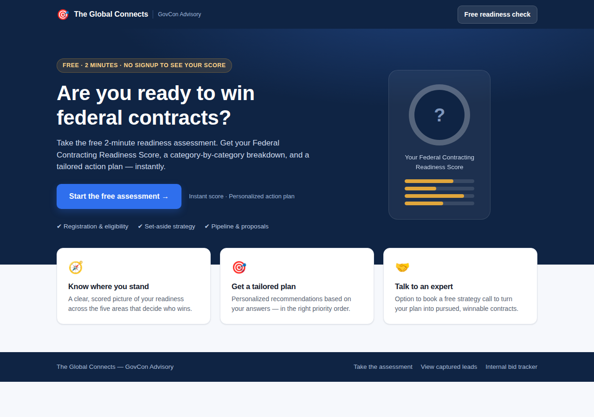
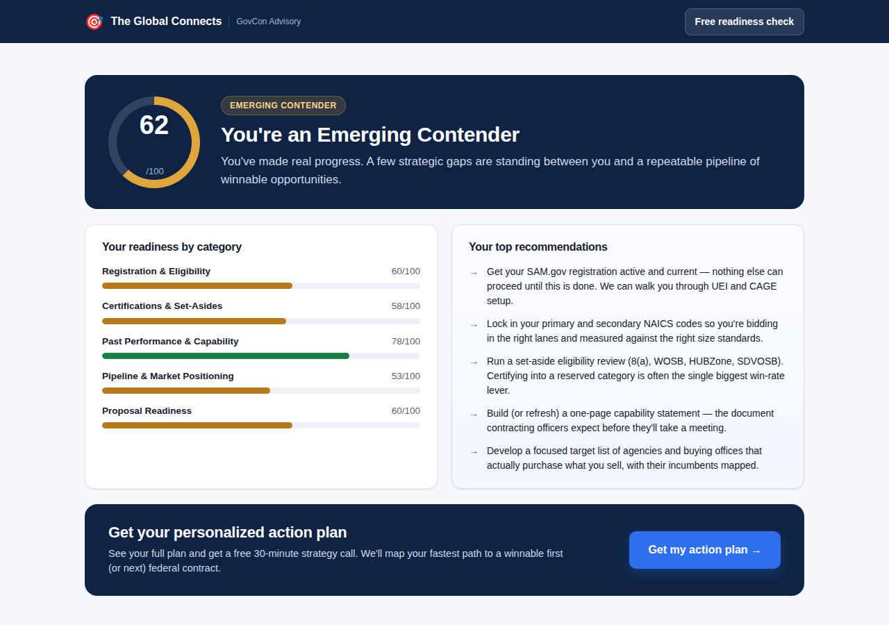

# 🎯 Federal Contracting Readiness Assessment — a lead-gen app for GovCon consultants

A conversion-focused **lead generation web app** for a government-contracting consulting business.
Prospects take a free 2-minute "Federal Contracting Readiness Assessment," instantly get a scored
readiness profile with tailored recommendations (real value that earns trust), and in exchange you
capture a **pre-qualified lead** — their contact details arrive *with their full readiness profile
attached*, so you know exactly who's worth a call before you pick up the phone.

Runs **100% in the browser** — no build step, no server, no accounts. Point it at one form endpoint
and leads flow straight to you.




---

## Why this generates leads (and better ones)

A bare "Contact us" form gets you strangers. This funnel gets you **qualified** prospects:

1. **Hook** — a free, valuable assessment is far more clickable than "request a consultation."
2. **Value first** — the score and recommendations are shown *before* any hard ask, which builds
   trust and dramatically lifts form completion.
3. **Qualification built in** — every lead arrives tagged with a readiness score, tier, and
   category breakdown. A "Getting Started / score 24" lead and a "Contract-Ready / score 88" lead
   need very different conversations — now you know which is which instantly.
4. **Warm handoff** — the thank-you screen offers a booking link (Calendly, etc.), turning the lead
   into a scheduled strategy call.

The assessment scores five weighted categories that decide who wins federal work:
**Registration & Eligibility · Certifications & Set-Asides · Past Performance & Capability ·
Pipeline & Market Positioning · Proposal Readiness.**

---

## Make it yours in 2 minutes

Everything you need to customize lives at the top of **`js/assessment.js`** in the `CONFIG` block:

```js
window.CONFIG = {
  brandName:   "The Global Connects",   // your business name
  tagline:     "GovCon Advisory",
  headline:    "Are you ready to win federal contracts?",
  subhead:     "...",
  contactEmail:"you@yourfirm.com",
  calendlyUrl: "",   // paste your booking link -> adds a "Book a call" button
  leadEndpoint:""    // paste your form/webhook URL -> leads get delivered to you
};
```

You can also edit the questions, scoring weights, score tiers, and recommendation rules in the same
file — no other code changes needed.

## Connecting lead delivery

Set `CONFIG.leadEndpoint` to any URL that accepts a JSON `POST`. Common options:

| Service | What to paste |
| --- | --- |
| **Formspree** | Your form endpoint, e.g. `https://formspree.io/f/xxxxxxx` — emails you each lead. |
| **Netlify Forms / Zapier / Make** | The webhook URL they give you. |
| **Google Sheets** | A Google Apps Script Web App URL that appends a row. |
| **Your CRM** | Any inbound webhook. |

Each lead is posted as JSON:

```json
{ "name": "...", "email": "...", "company": "...", "phone": "...", "goal": "...",
  "score": 62, "tier": "Emerging Contender",
  "categories": [ { "label": "Registration & Eligibility", "score": 60 }, ... ],
  "recommendations": [ "..." ], "submittedAt": "2026-...", "source": "Readiness Assessment" }
```

**No endpoint yet?** The app runs in **demo mode**: every lead is saved in the browser and viewable
at **`#/leads`** ("View captured leads" in the footer), with one-click **CSV export**. Nothing is
ever lost — even with a live endpoint, a local backup copy is always kept.

## Running it

Just open `index.html`:

```bash
open index.html                 # macOS
xdg-open index.html             # Linux
python3 -m http.server 8000     # or serve, then visit http://localhost:8000
```

To go live, host the folder on any static host (Netlify, Vercel, GitHub Pages, S3, your own site)
and embed a link/button to it from your website, email signature, or ad campaigns.

## Project structure

```
index.html          # the funnel (landing → assessment → results → lead form → thank-you → leads admin)
css/leadgen.css     # styling (light/dark aware, responsive)
js/assessment.js    # YOUR CONFIG + questions, scoring, tiers, recommendations
js/leadgen.js       # routing, wizard, scoring, lead capture/delivery, CSV export
tracker.html + js/app.js + js/data.js + css/styles.css   # bonus: internal bid-pipeline tracker (see below)
```

## Bonus: internal bid tracker

`tracker.html` is a separate internal tool (also linked in the footer) for managing *your own* bid
pipeline once leads become clients — a drag-and-drop opportunity board, deadline tracking, and a
SAM.gov/certification compliance monitor. Fully self-contained.

## Notes & honesty

- Vanilla HTML/CSS/JS, zero dependencies. Verified end-to-end with a headless-browser test
  (landing → scored results → lead capture → thank-you → admin table).
- The assessment is a qualification and marketing tool, not legal/eligibility advice — always
  confirm program rules against SAM.gov and SBA.gov.
- Leads contain real people's contact info. If you deploy publicly, add a link to your privacy
  policy and make sure your `leadEndpoint` provider is one you trust.
