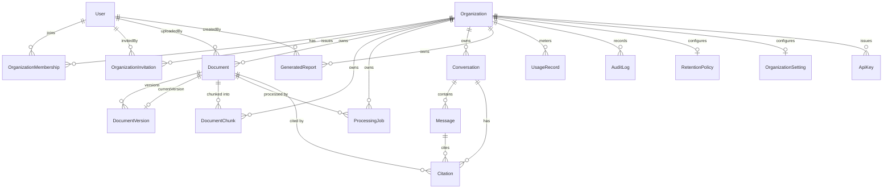

# Portal Data Model

Reference for the **Global Connects Client Intelligence Portal** persistence
layer. The authoritative source is `portal/prisma/schema.prisma`; this document
explains it. Table names below are the `@@map` names (snake_case); model names
are the Prisma models.

All persistence is PostgreSQL 16 with the `vector` (pgvector) extension. Every
model uses a UUID primary key (`@db.Uuid`, `@default(uuid())`).

---

## 1. Tenancy invariant

> Every client-owned record carries an **immutable `organizationId`**. The
> application layer (`src/lib/authz`) injects the authorized organization into
> every query. The schema encodes the foreign keys, indexes, and org-scoped
> unique constraints that back this guarantee — **but the database alone does not
> enforce tenancy; the repository layer does.**

There is no row-level-security policy in the schema. Isolation is a code
invariant enforced by `authz` plus org-scoped `WHERE` clauses (and, for vectors,
a mandatory `organizationId` filter in raw SQL). Cross-tenant access attempts
resolve to 404, never 403.

**Soft delete:** `deletedAt` (nullable timestamp) marks logical deletion on
`User`, `Organization`, `Document`, `Conversation`, and `GeneratedReport`.
Soft-deleted rows are excluded from normal reads by explicit
`deletedAt: null` filters. Models without `deletedAt`
(`Message`, `Citation`, `DocumentChunk`, `AuditLog`, `UsageRecord`,
`ProcessingJob`, membership/invitation/settings rows) are removed by cascade or
by explicit purge, not soft-deleted.

---

## 2. Entity-relationship overview



---

## 3. Enums

| Enum | Values |
|---|---|
| `PlatformRole` | `SUPER_ADMIN`, `MEMBER` |
| `OrgRole` | `ADMIN`, `ANALYST`, `VIEWER` (hierarchy VIEWER < ANALYST < ADMIN) |
| `OrgStatus` / `UserStatus` / `MembershipStatus` | `ACTIVE`, `SUSPENDED` |
| `InvitationStatus` | `PENDING`, `ACCEPTED`, `EXPIRED`, `REVOKED` |
| `DocumentStatus` | `UPLOADING`, `PENDING`, `PROCESSING`, `READY`, `FAILED`, `DELETED` |
| `ClassificationLevel` | `PUBLIC`, `INTERNAL`, `CONFIDENTIAL`, `RESTRICTED` |
| `ProcessingJobStatus` | `QUEUED`, `RUNNING`, `COMPLETED`, `FAILED`, `RETRYING`, `CANCELLED` |
| `JobType` | `DOCUMENT_PROCESSING`, `RETENTION_SWEEP`, `DATA_EXPORT` |
| `MessageRole` | `USER`, `ASSISTANT`, `SYSTEM` |
| `RetentionMode` | `INDEFINITE`, `DELETE_AFTER_DAYS` |
| `ReportType` | `DOCUMENT_SUMMARY`, `REQUIREMENTS_EXTRACTION`, `RISK_ANALYSIS`, `COMPLIANCE_MATRIX`, `COMPARISON`, `EXECUTIVE_BRIEF`, `ACTION_ITEMS` |
| `ReportStatus` | `DRAFT`, `GENERATING`, `COMPLETED`, `FAILED` |

---

## 4. Models

### 4.1 User (`users`)

- **Purpose:** a person who authenticates. Global (not org-owned); org access is
  granted through memberships.
- **Key fields:** `email` (`@unique`), `name?`, `cognitoSub?` (`@unique`,
  Cognito subject; null for dev-adapter accounts), `devPasswordHash?` (PBKDF2,
  **dev auth only, never populated in prod**), `platformRole`, `status`,
  `emailVerified`, `mfaEnabled`, `lastLoginAt`.
- **Tenancy:** none — a user is not org-scoped. Membership rows connect users to
  organizations.
- **Soft delete:** yes (`deletedAt`). `requireAuthenticatedUser` filters
  `deletedAt: null` and rejects `SUSPENDED`.
- **Indexes/constraints:** unique `email`, unique `cognitoSub`, `@@index([status])`.
- **Relationships:** memberships, uploaded documents (`UploadedBy`), messages,
  reports, audit logs, sent invitations (`InvitedBy`), usage records.

### 4.2 Organization (`organizations`)

- **Purpose:** the tenant boundary. Everything client-owned points here.
- **Key fields:** `name`, `slug` (`@unique`), `status`.
- **Tenancy:** is the tenant.
- **Soft delete:** yes. `getAuthorizedOrganization` ignores deleted orgs.
- **Indexes/constraints:** unique `slug`, `@@index([status])`.
- **Relationships:** owns nearly every other model, plus one-to-one
  `RetentionPolicy` and `OrganizationSetting`.

### 4.3 OrganizationMembership (`organization_memberships`)

- **Purpose:** the join that grants a user a role in an organization.
- **Key fields:** `organizationId`, `userId`, `role` (default `VIEWER`),
  `status`.
- **Tenancy:** carries `organizationId`.
- **Soft delete:** none — a user is removed by deleting the membership; cascades
  on org or user delete.
- **Indexes/constraints:** **`@@unique([organizationId, userId])`** (a user has at
  most one membership per org), `@@index([userId])`,
  `@@index([organizationId, role])`.
- **Relationships:** `organization` (cascade), `user` (cascade).

### 4.4 OrganizationInvitation (`organization_invitations`)

- **Purpose:** pending invite of an email to an org at a role.
- **Key fields:** `email`, `role`, `tokenHash` (`@unique`, **SHA-256 of the raw
  token; the raw token is emailed once and never stored**), `status`,
  `invitedById`, `expiresAt`, `acceptedAt?`.
- **Tenancy:** carries `organizationId`.
- **Indexes/constraints:** unique `tokenHash`,
  **`@@unique([organizationId, email, status])`** (one invite per email/status
  per org), `@@index([organizationId])`.
- **Relationships:** `organization` (cascade), `invitedBy` (`InvitedBy`).

### 4.5 Document (`documents`)

- **Purpose:** a logical document owned by an org; the versioned bytes live in
  S3.
- **Key fields:** `title`, `originalFileName`, `mimeType`, `fileSizeBytes`
  (`BigInt`), `sha256?`, `status` (default `UPLOADING`), `classification`
  (default `CONFIDENTIAL`), `currentVersionId?` (`@unique`, points at the live
  version), `uploadedById`, `pageCount?`, `chunkCount` (default 0),
  `processingError?`, `retentionDate?`, `legalHold` (default false).
- **Tenancy:** carries `organizationId`.
- **Soft delete:** yes. `assertDocumentAccess` and vector search both filter
  `deletedAt: null`; soft delete also sets `status=DELETED` and immediately
  removes embeddings.
- **Indexes/constraints:** unique `currentVersionId`,
  `@@index([organizationId, status])`, `@@index([organizationId, deletedAt])`,
  `@@index([organizationId, createdAt])`.
- **Relationships:** `organization` (cascade), `uploadedBy`, `versions`
  (`DocumentVersions`), `currentVersion` (`CurrentVersion`), `chunks`,
  `citations`, `jobs`.

### 4.6 DocumentVersion (`document_versions`)

- **Purpose:** an immutable pointer to one stored copy of a document's bytes.
- **Key fields:** `versionNumber`, `s3Key` (**server-controlled; the browser
  never chooses it**), `s3Bucket`, `fileSizeBytes`, `sha256?`, `mimeType`.
- **Tenancy:** carries `organizationId`.
- **Soft delete:** none — versions are removed on purge / cascade.
- **Indexes/constraints:** **`@@unique([documentId, versionNumber])`**,
  `@@index([organizationId])`. Reciprocal `currentVersion` relation gives the
  parent document its live version.
- **Relationships:** `document` (`DocumentVersions`, cascade), optional
  `currentForDoc` (`CurrentVersion`).

### 4.7 DocumentChunk (`document_chunks`)

- **Purpose:** one retrievable text chunk plus its pgvector embedding.
- **Key fields:** `chunkIndex`, `content`, `tokenCount`, location metadata
  (`page?`, `section?`, `sheet?`, `rowRange?`), and
  **`embedding Unsupported("vector(1024)")?`** — the pgvector column.
- **Tenancy:** carries `organizationId` **by design, for defence in depth** — a
  missing join filter still cannot leak across organizations because chunk search
  filters `organizationId` directly.
- **Soft delete:** none — chunks are hard-deleted when a document is soft-deleted
  (so deleted docs are instantly unsearchable) and on version rebuild / purge.
- **Indexes/constraints:** **`@@unique([documentId, versionId, chunkIndex])`**
  (idempotent chunk identity), `@@index([organizationId])`,
  `@@index([documentId])`.
- **Relationships:** `organization` (cascade), `document` (cascade).

### 4.8 ProcessingJob (`processing_jobs`)

- **Purpose:** the durable, database-backed job queue row (the platform runs no
  Redis). Also used for retention sweeps and data exports.
- **Key fields:** `type` (default `DOCUMENT_PROCESSING`), `status` (default
  `QUEUED`), `documentId?`, and the claim/retry machinery: `lockedBy?`,
  `lockedAt?`, `attempts`, `maxAttempts` (default 3), `runAfter` (default now),
  `lastError?`, `payload? Json`, `metrics? Json`, `startedAt?`, `finishedAt?`.
- **Tenancy:** carries `organizationId`.
- **Soft delete:** none.
- **Indexes/constraints:** **`@@index([status, runAfter])`** — the exact shape
  the claimer queries (`status IN (QUEUED, RETRYING) AND runAfter <= now ORDER BY
  createdAt`); `@@index([organizationId])`.
- **Relationships:** `organization` (cascade), `document` (**`onDelete: SetNull`**
  so purging a document does not delete its job history).

### 4.9 Conversation (`conversations`)

- **Purpose:** a RAG chat thread within an org.
- **Key fields:** `createdById`, `title` (default "New conversation"),
  `documentScope String[]` (default `[]`) — optional restriction of retrieval to
  a subset of documents.
- **Tenancy:** carries `organizationId`.
- **Soft delete:** yes; `assertConversationAccess` filters `deletedAt: null`.
- **Indexes/constraints:** `@@index([organizationId, createdById])`,
  `@@index([organizationId, updatedAt])`.
- **Relationships:** `organization` (cascade), `messages`, `citations`.

### 4.10 Message (`messages`)

- **Purpose:** one turn in a conversation (user question or assistant answer).
- **Key fields:** `role` (`USER`/`ASSISTANT`/`SYSTEM`), `content`,
  `insufficientEvidence` (default false — whether retrieval found enough to
  answer), `modelId?`, `inputTokens?`, `outputTokens?`, `userId?`.
- **Tenancy:** carries `organizationId`.
- **Soft delete:** none.
- **Indexes/constraints:** `@@index([conversationId])`,
  `@@index([organizationId])`.
- **Relationships:** `organization` (cascade), `conversation` (cascade),
  `user?` (**`SetNull`** — a deleted user's messages remain in the thread),
  `citations`.

### 4.11 Citation (`citations`)

- **Purpose:** a grounded reference from an assistant message to a source
  document excerpt.
- **Key fields:** `documentId`, `chunkId?`, `excerpt`, location metadata
  (`page?`, `section?`, `sheet?`, `rowRange?`), `similarity` (cosine).
- **Tenancy:** carries `organizationId`.
- **Soft delete:** none.
- **Indexes/constraints:** `@@index([messageId])`, `@@index([organizationId])`.
- **Relationships:** `organization`, `conversation`, `message`, `document` — all
  cascade.

### 4.12 GeneratedReport (`generated_reports`)

- **Purpose:** an org-scoped, grounded report produced from a template.
- **Key fields:** `type` (`ReportType`), `status` (default `DRAFT`), `title`,
  `contentMarkdown?` (rendered Markdown; DOCX/PDF exporters can be layered on
  later), `modelId?`, `documentScope String[]`, `citations? Json`, `error?`.
- **Tenancy:** carries `organizationId`.
- **Soft delete:** yes.
- **Indexes/constraints:** `@@index([organizationId, type])`.
- **Relationships:** `organization` (cascade), `createdBy`.

### 4.13 UsageRecord (`usage_records`)

- **Purpose:** per-event metering for cost control and analytics.
- **Key fields:** `kind` (`"chat"`, `"embedding"`, `"report"`,
  `"classification"`, ...), `modelId?`, `inputTokens`, `outputTokens`,
  `embeddingTokens`, **`estimatedCostMicroUsd BigInt`** (cost in micro-USD,
  `1e-6` USD, to avoid float drift), `requestId?`.
- **Tenancy:** carries `organizationId`.
- **Soft delete:** none.
- **Indexes/constraints:** `@@index([organizationId, createdAt])`,
  `@@index([organizationId, userId, createdAt])` — the shapes the monthly-org and
  daily-per-user limit checks query.
- **Relationships:** `organization` (cascade), `user?` (`SetNull`).

### 4.14 AuditLog (`audit_logs`)

- **Purpose:** append-only security/action audit trail.
- **Key fields:** `action`, `resourceType?`, `resourceId?`, `outcome` (default
  `"success"`), `ipAddress?`, `userAgent?`, `requestId?`, `metadata? Json`
  (**only non-sensitive metadata — never document contents or secrets**).
- **Tenancy:** `organizationId?` is **nullable** (platform-level events have no
  org); relations are `SetNull` so audit rows survive org/user deletion.
- **Soft delete / mutation:** **append-only from the application's perspective —
  no update or delete path.** Writes are best-effort and never break the primary
  action.
- **Indexes/constraints:** `@@index([organizationId, createdAt])`,
  `@@index([action])`, `@@index([createdAt])`.
- **Relationships:** `organization?` (`SetNull`), `user?` (`SetNull`).

*This is application-level append-only, not a WORM/tamper-proof store by itself.*

### 4.15 RetentionPolicy (`retention_policies`)

- **Purpose:** per-org retention/purge configuration.
- **Key fields:** `mode` (`INDEFINITE` | `DELETE_AFTER_DAYS`), `retentionDays?`,
  **`purgeGraceDays`** (default 7 — the window between soft-delete and permanent
  purge), `updatedById?`.
- **Tenancy:** `organizationId` (`@unique`) — **one policy per org**.
- **Relationships:** `organization` (cascade).

### 4.16 OrganizationSetting (`organization_settings`)

- **Purpose:** per-org cost controls, model routing overrides, and retrieval
  tuning.
- **Key fields:** `monthlyTokenLimit BigInt` (default 5,000,000),
  `dailyQueryLimitPerUser` (default 200), `maxRetrievedChunks` (8),
  `maxContextTokens` (6000), `maxOutputTokens` (1024), `warnThresholdPercent`
  (80), model overrides `lowCostModelId?` / `standardModelId?` /
  `advancedModelId?` (fall back to env when null), `similarityThreshold`
  (default 0.2).
- **Tenancy:** `organizationId` (`@unique`) — **one settings row per org**.
- **Relationships:** `organization` (cascade).

### 4.17 ApiKey (`api_keys`)

- **Purpose:** programmatic org access via a hashed key.
- **Key fields:** `name`, `keyHash` (`@unique`, **SHA-256 of the raw key; raw key
  shown once at creation, never stored**), `prefix` (display/lookup hint),
  `scopes String[]`, `lastUsedAt?`, `expiresAt?`, `revokedAt?`.
- **Tenancy:** carries `organizationId`.
- **Indexes/constraints:** unique `keyHash`, `@@index([organizationId])`.
- **Relationships:** `organization` (cascade).

---

## 5. The pgvector embedding column and raw SQL

`DocumentChunk.embedding` is declared `Unsupported("vector(1024)")?` because
Prisma cannot bind the pgvector `vector` type natively. All embedding I/O
therefore uses **parameterized raw SQL** in `src/lib/rag/vectors.ts`:

- **Insert** — `insertChunkWithEmbedding` writes the row with the vector cast
  (`${vec}::vector`) and is idempotent via
  `ON CONFLICT ("documentId","versionId","chunkIndex") DO NOTHING`.
- **Search** — `searchChunks` runs a cosine nearest-neighbour query using the
  pgvector `<=>` operator (`similarity = 1 - (embedding <=> query)`), joined to
  `documents` and filtered by:
  1. `organizationId` (**hard tenant boundary — always present**),
  2. `documents.deletedAt IS NULL` and `documents.status = 'READY'`,
  3. an optional `documentId = ANY(...)` subset (conversation/report scope),
  4. `similarity >= threshold` (org-configurable, default 0.2).

The vector literal is built only from numbers the server produced (finite-checked
and joined), never from user string interpolation, and the query dimension is
asserted equal to `AWS_BEDROCK_EMBEDDING_DIMENSION` (1024) before use.

**Because tenancy filters live inside the raw SQL itself, a vector search cannot
cross tenants even if a higher-level check is forgotten.**

---

## 6. Org-scoped uniqueness and the tenant-isolation invariant

Uniqueness is deliberately scoped by organization rather than global where the
domain requires it:

| Constraint | Meaning |
|---|---|
| `OrganizationMembership @@unique([organizationId, userId])` | one membership per user per org |
| `OrganizationInvitation @@unique([organizationId, email, status])` | one invite per email+status per org |
| `DocumentVersion @@unique([documentId, versionNumber])` | version numbers unique within a document |
| `DocumentChunk @@unique([documentId, versionId, chunkIndex])` | stable, idempotent chunk identity |
| `Organization.slug @unique` / `User.email @unique` | genuinely global identifiers |
| `RetentionPolicy.organizationId @unique` / `OrganizationSetting.organizationId @unique` | one-to-one config per org |

The data-layer invariant: **every client-owned row carries `organizationId`, and
every read/write is org-filtered by the application.** The schema's cascade rules
reinforce this — deleting an `Organization` cascades to its documents, versions,
chunks, conversations, messages, citations, reports, jobs, usage, memberships,
invitations, settings, and keys — while `SetNull` on `AuditLog`, `UsageRecord`,
`Message.user`, and `ProcessingJob.document` preserves history where it must
outlive the referenced row.

---

## 7. Retention and deletion data model

Two-phase lifecycle (`src/lib/retention.ts`), backed by these fields:

```
Document.retentionDate  --- phase 1 (soft delete) --->  Document.deletedAt set,
Document.legalHold                                       status = DELETED,
RetentionPolicy.purgeGraceDays                           chunks hard-deleted
                                                              |
                                                         phase 2 (purge, after grace)
                                                              v
                                                    S3 objects + versions + chunks
                                                    permanently removed (cascade)
```

- **`Document.retentionDate`** — when set and passed (and not on hold), the
  retention sweep soft-deletes the document.
- **`Document.legalHold`** — a boolean that **exempts a document from both
  soft-delete and purge** regardless of retention date. Hold wins.
- **`Document.deletedAt`** — logical deletion timestamp; embeddings/chunks are
  removed immediately on soft delete so a deleted document is instantly
  unsearchable.
- **`RetentionPolicy.purgeGraceDays`** — the grace window (default 7 days) after
  `deletedAt` before permanent purge. Purge deletes the S3 objects for every
  version and then hard-deletes the `Document`, cascading versions and chunks.

**On backups (not overclaimed):** application soft-delete and purge remove *live*
application data and object-store objects. They do **not** instantly erase data
from infrastructure backups. RDS automated backups / point-in-time-recovery
windows and S3 versioning/lifecycle rules expire on their own schedules,
configured at the infrastructure layer — separate from this application model.

---

## 8. Supporting the GovCon roadmap without new tables

The schema is intentionally general so the planned GovCon workload
(solicitation analysis, FAR/DFARS requirement extraction, compliance matrices,
proposal outlines, past-performance, capability statements, pricing workbooks,
bid/no-bid, subcontractor documents) can be added **without new tables**:

- The **`ReportType` enum** already carries general analytical templates
  (`REQUIREMENTS_EXTRACTION`, `RISK_ANALYSIS`, `COMPLIANCE_MATRIX`, `COMPARISON`,
  `EXECUTIVE_BRIEF`, ...). GovCon deliverables slot in as additional enum values
  plus templates and retrieval queries — reusing `GeneratedReport` unchanged.
- The **generic `Document` / `DocumentVersion` / `DocumentChunk`** model is
  content-type agnostic (PDF, DOCX, spreadsheets), so solicitations and pricing
  workbooks are ordinary documents. Location metadata (`page`, `section`,
  `sheet`, `rowRange`) already supports precise citation into spreadsheets and
  long PDFs.
- **`ClassificationLevel`** provides a per-document sensitivity label
  (`PUBLIC`..`RESTRICTED`) that GovCon handling rules can build on.
- **`Conversation.documentScope` / `GeneratedReport.documentScope`** let analysis
  be constrained to, e.g., a single solicitation package.

This is a designed-for extension surface, **not an implemented GovCon feature
set.** Implementing it means new templates, prompts, and validation on top of the
existing tables — no schema migration for storage shape is anticipated.
